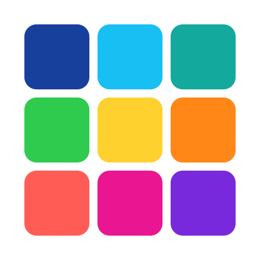

<div align="center">
  

  # Mosaic Bridge

  **让桌面应用与浏览器扩展稳定协作的本地桥接服务。**

  [快速开始](#快速开始) · [API 概览](#api-概览) · [架构](#架构) · [开发调试](#开发调试)

  
  
  
  
</div>

<br>

Mosaic Bridge 是 **DarkEye 桌面套件**的本地扩展网关。它运行在 `127.0.0.1:56790`，通过 **SSE** 将必须在真实浏览器中完成的采集任务交给 Chrome 或 Firefox 扩展执行，并将其他桌面端接口安全地转发到主程序。

> **隐私优先**：服务和扩展默认只在本机通信，不会将业务数据上传到远端服务器。

## 它负责什么

| 能力 | 说明 |
|---|---|
| 浏览器协作 | 向已连接扩展推送导航、合并采集、人物页与封面抓取任务。 |
| 可靠回传 | 以 `request_id` 对齐任务和异步回调；未连接或超时会返回清晰的错误。 |
| 桌面端桥接 | 将查重、采集流程和提示等接口转发给运行在 `56789` 的主程序。 |
| 本地运行 | 默认仅绑定 `127.0.0.1`，无需暴露公网端口。 |

## 架构

```text
┌──────────────────┐     HTTP 转发      ┌────────────────────────┐
│  DarkEye Desktop │ ─────────────────► │     Mosaic Bridge      │
│     :56789       │ ◄───────────────── │       :56790           │
└──────────────────┘                    └───────────┬────────────┘
                                                     │ SSE / REST
                                       ┌─────────────┴─────────────┐
                                       │                           │
                              ┌────────▼────────┐        ┌────────▼────────┐
                              │ Chrome Extension │        │ Firefox Extension│
                              └─────────────────┘        └─────────────────┘
```

## 快速开始

### 1. 安装依赖

项目使用 [uv](https://docs.astral.sh/uv/) 管理 Python 与依赖。先安装 uv，再在项目根目录执行：

```powershell
uv sync
```

### 2. 启动服务

```powershell
uv run mosaic-bridge
```

也可直接运行：

```powershell
uv run python main.py
```

启动后访问：

- [Swagger UI](http://127.0.0.1:56790/docs)
- [ReDoc](http://127.0.0.1:56790/redoc)
- [健康检查](http://127.0.0.1:56790/api/v1/health)

### 3. 加载浏览器扩展

在浏览器的开发者模式中，加载以下目录中的 `manifest.json`：

- `extensions/chrome_capture/` — Chrome（Manifest V3）
- `extensions/firefox_capture/` — Firefox（Manifest V2）

确认扩展中的本地地址指向 `127.0.0.1:56790`。扩展连接 `/events` 后，涉及浏览器的采集接口即可使用。

## 配置

| 环境变量 | 用途 | 默认值 |
|---|---|---|
| `DARKEYE_MAIN_BASE_URL` | 桌面主程序 HTTP 根地址（不带末尾 `/`） | `http://127.0.0.1:56789` |

## API 概览

| 方法 | 路径 | 用途 |
|---|---|---|
| `GET` | `/api/v1/health` | 服务健康检查 |
| `GET` | `/events` | 浏览器扩展建立 SSE 长连接 |
| `POST` | `/api/v1/navigate` | 让已连接扩展打开 URL |
| `GET` | `/api/v1/work/{serial_number}` | 触发影片信息合并抓取 |
| `GET` | `/api/v1/actress/{actress_jp_name}` | 触发人物页抓取 |
| `GET` | `/api/v1/top-actresses` | 获取热门人物列表 |
| `POST` | `/api/v1/image` | 经扩展获取封面图片 |
| `*` | `/api/v1/{path}` | 未显式处理的路径代理到桌面主程序 |

完整的 REST、SSE 事件及回调格式见 [API 文档](docs/API.md)。

## 开发调试

### VS Code / Cursor

项目提供 `.vscode/launch.json`：

- **Worker: main.py**：适合断点调试，单进程运行。
- **Worker: uvicorn app:app**：适合开发时自动重启；由于会启动子进程，复杂断点调试更推荐前者。

选择由 `uv sync` 创建的 `.venv` 解释器即可开始调试。

### 命令行检查

```powershell
# 服务启动后
Invoke-RestMethod http://127.0.0.1:56790/api/v1/health
```

需要扩展参与的接口必须先有扩展连接 `/events`；否则服务会返回 `503` 或对应的失败结果。

### 构建 Windows 可执行文件

```powershell
uv sync --group dev
.\build-installer.ps1
```

构建产物会输出到 `output/`，并附带 Chrome 与 Firefox 扩展压缩包。

## 项目结构

```text
.
├── app.py                  # FastAPI、SSE 任务编排与桌面端转发
├── main.py                 # Uvicorn 启动入口
├── extensions/             # Chrome / Firefox 扩展源码
├── docs/
│   ├── API.md              # 接口与事件说明
│   └── assets/             # 品牌资源
├── build-installer.ps1     # Windows 构建脚本
└── pyproject.toml          # 包元数据与依赖
```

## 开发说明

- 依赖和锁文件由 **uv** 管理：使用 `uv sync`、`uv lock` 与 `uv run`，避免直接用 `pip` 修改环境。
- Worker 的日志名为 `server2.worker`；需要更详细输出时可在本地将该 logger 调至 `DEBUG`。
- 合并抓取、人物页与榜单任务默认等待 120 秒；封面抓取默认等待 30 秒。

## 许可

当前项目为 **Proprietary**。如计划开源，请更新 `pyproject.toml` 中的许可声明，并在仓库内提供对应许可证全文。
